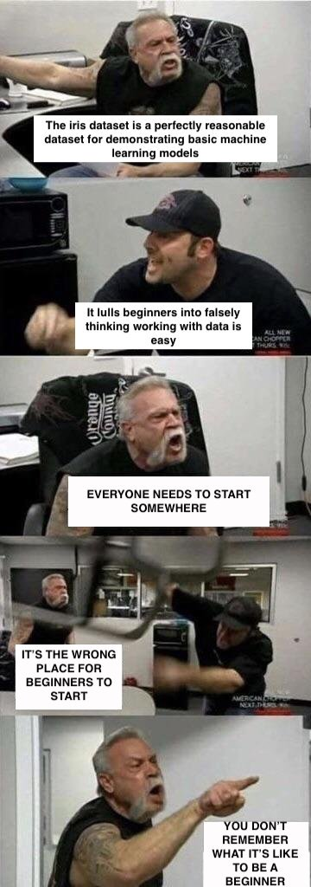

# Annotated K-Nearest Neighbors - Lab

## Introduction

In this lesson, we'll walkthrough the key components to build a simple version of a **_K-Nearest Neigbors Classifier_** from scratch.

## Objectives

You will be able to:

* Understand how to implement a basic KNN algorithm from scratch

In order to build our KNN Classifier, we're going to import the [**_Iris Dataset_**](https://gist.github.com/curran/a08a1080b88344b0c8a7). 



> This famous (Fisher's or Anderson's) `iris` data set gives the measurements in centimeters of the variables sepal length and width and petal length and width, respectively, for 50 flowers from each of 3 species of iris. The species are Iris setosa, versicolor, and virginica. - [R Documentation](https://stat.ethz.ch/R-manual/R-devel/library/datasets/html/iris.html)

Using the length and width of both petals and sepals, we're going to use our KNN Classifier to predict the species of a small subset of `iris` records.


```python
from scipy.spatial.distance import euclidean as euc
import numpy as np
np.random.seed(0)
from sklearn.datasets import load_iris
from sklearn.model_selection import train_test_split
from sklearn.metrics import accuracy_score

iris = load_iris()
data = iris["data"]
target = iris["target"]
```

    /Users/cristiannuno/ENTER/lib/python3.5/site-packages/sklearn/utils/fixes.py:313: FutureWarning: numpy not_equal will not check object identity in the future. The comparison did not return the same result as suggested by the identity (`is`)) and will change.
      _nan_object_mask = _nan_object_array != _nan_object_array


As we can see, `data` has 4-columns, one for each type of measurement.


```python
data[:5]
```


    array([[ 5.1,  3.5,  1.4,  0.2],
           [ 4.9,  3. ,  1.4,  0.2],
           [ 4.7,  3.2,  1.3,  0.2],
           [ 4.6,  3.1,  1.5,  0.2],
           [ 5. ,  3.6,  1.4,  0.2]])


However, `target` has numerical values of `0`, `1`, and `2` to identify the `species` of each flower:

* 0 = setosa
* 1 = versicolor
* 2 = virginica


```python
target[:5]
```


    array([0, 0, 0, 0, 0])


Now, you'll need to use `train_test_split()` to split our training data into training and testing sets. Pass in the `data`, the `target`, a `test_size` of 0.25, and `random_state` of 2019 for reproducibility.


```python
X_train, X_test, y_train, y_test = train_test_split(data,
                                                    target,
                                                    test_size=0.25,
                                                    random_state=2019)
```

## Calculating distance

Each item in `X_test` is a vector (one row from the original `data` array). Our current goal is to calculate the [Euclidean distance](https://docs.scipy.org/doc/scipy/reference/generated/scipy.spatial.distance.euclidean.html#scipy.spatial.distance.euclidean) between each item in `X_test` and every vector in `X_train`.


```python
X_test[0]
```


    array([ 4.4,  3.2,  1.3,  0.2])


```python
X_train[0]
```


    array([ 4.3,  3. ,  1.1,  0.1])


```python
euc(X_test[0], X_train[0])
```


    0.31622776601683816


While we could build an empty list and append each result from `euc()` inside of the list, I wanted to try it using an empty numpy array instead!

### Introducing structured arrays

> Structured arrays are ndarrays whose datatype is a composition of simpler datatypes organized as a sequence of named [fields](https://docs.scipy.org/doc/numpy/glossary.html#term-field).

> Each field within a structured datatype has a name, a datatype, and a byte offset within the structure. Structured datatypes may be created using the function [`numpy.dtype()`](https://docs.scipy.org/doc/numpy/reference/generated/numpy.dtype.html#numpy.dtype).

While there are four [Data Types](https://docs.scipy.org/doc/numpy/reference/arrays.dtypes.html#arrays-dtypes-constructing), we'll only be talking about a list of tuples (one tuple per field).

#### List of tuples in an array
> Each tuple has the form (`fieldname`, `datatype`, `shape`) where `shape` is optional. `fieldname` is a string (or tuple if titles are used, see Field Titles below), `datatype` may be any object convertible to a datatype, and `shape` is a tuple of integers specifying subarray shape.

The newly created `custom_dtype` specifies a `datatype` that is a list of tuples, with the first element an integer named "index" and the second element a float named "distance".


```python
custom_dtype = np.dtype([("index", "int"), ("distance", "float64")])
custom_dtype
```


    dtype([('index', '<i8'), ('distance', '<f8')])


Unlike an empty list, an [empty numpy array](https://docs.scipy.org/doc/numpy/reference/generated/numpy.zeros.html) **requires** us to know the final length of the object prior to creating it.


```python
empty_array = np.zeros(4, dtype=custom_dtype)
empty_array
```


    array([(0, 0.0), (0, 0.0), (0, 0.0), (0, 0.0)], 
          dtype=[('index', '<i8'), ('distance', '<f8')])


To reassign elements in an array, we need to index the array and supply the new information on the right hand side.


```python
empty_array[0] = (0, 2.2)
empty_array[1] = (1, 6.5)
empty_array[2] = (2, 1.1)
empty_array[3] = (3, 7.7)
empty_array
```


    array([(0, 2.2), (1, 6.5), (2, 1.1), (3, 7.7)], 
          dtype=[('index', '<i8'), ('distance', '<f8')])


By naming each element in the list of tuples, we can index `empty_array` to only access specific elements by their `fieldname`. 

The result is 1-dimensional array.


```python
empty_array["index"]
```


    array([0, 1, 2, 3])


```python
empty_array["distance"]
```


    array([ 2.2,  6.5,  1.1,  7.7])


With this knowledge in our pocket, let's create `get_distance()`.


```python
def get_distances(x):
    """
    Calculate the Euclidean distance between the input array and every other vector in our training set
    """
    custom_dtype = np.dtype([("index", "int"), ("distance", "float64")])
    
    distances = np.zeros(len(X_train), dtype=custom_dtype)
    
    for ind, val in enumerate(X_train):
        dist_to_val = euc(x, val)
        distances[ind] = (ind, dist_to_val)
    
    return distances

```


```python
distances = get_distances(X_test[0])
```


```python
distances[:10]
```


    array([(0, 0.31622776601683816), (1, 4.611941023040083),
           (2, 1.1180339887498942), (3, 3.2695565448543626),
           (4, 0.3162277660168373), (5, 5.923681287847955),
           (6, 3.661966684720111), (7, 3.9509492530276824),
           (8, 0.5099019513592781), (9, 2.1633307652783933)], 
          dtype=[('index', '<i8'), ('distance', '<f8')])


```python
distances["index"][:10]
```


    array([0, 1, 2, 3, 4, 5, 6, 7, 8, 9])


```python
distances["distance"][:10]
```


    array([ 0.31622777,  4.61194102,  1.11803399,  3.26955654,  0.31622777,
            5.92368129,  3.66196668,  3.95094925,  0.50990195,  2.16333077])


## Identifying K Nearest Neighbors

Now that we have our distances between `X_test[0]` and every vector in `X_train`, let's limit the results to only those that are most like `X_test[0]` (i.e. those with the smallest distances are more similar; those with larger distances are less similar)


```python
empty_array.sort(order="distance")
empty_array
```


    array([(2, 1.1), (0, 2.2), (1, 6.5), (3, 7.7)], 
          dtype=[('index', '<i8'), ('distance', '<f8')])


### Sorting a list of tuples by `fieldname`

Because `distances` is an array with a list of named tuples, we can use [`np.sort()`](https://docs.scipy.org/doc/numpy/reference/generated/numpy.sort.html) to return a sorted copy of `distances` by the values in one or more `fieldname`'s. In this case, we want `distances` that are closest to zero.

As is, `np.sort()` returns a copy of the array in ascending order. By supplying `k`, we can limit the number of distances returned.


```python
def get_k_nearest(dists, k=3):
    """
    Identifiy the K nearest neighbors to the vector we want to predict
    """
    dists.sort(order="distance")
    return dists[:k]
```


```python
k_nearest = get_k_nearest(dists=distances)
```


```python
k_nearest
```


    array([(70, 0.29999999999999954), (51, 0.2999999999999998),
           (4, 0.3162277660168373)], 
          dtype=[('index', '<i8'), ('distance', '<f8')])


## Identifying the majority label our `k_nearest` elements share in common

Remember, each element in `k_nearest` is a tuple: the 1st element in the index from the `X_train` vector and the 2nd element is the distance between `X_test[0]` and that particular vector.


```python
note = "The y_train values at index {} are {}, {} and {}.".format(list(k_nearest["index"]),
                                                                 y_train[70],
                                                                 y_train[51],
                                                                 y_train[4])
print(note)
```

    The y_train values at index [70, 51, 4] are 0, 0 and 0.


Let's build a function that subsets `y_train` to only those labels that share the same `index` values in `k_nearest`. 

Afterwards, obtain the total counts for each label by using [`np.bincount()`](https://docs.scipy.org/doc/numpy/reference/generated/numpy.bincount.html). Since we're interested in the label that is shared by the majority of elements in `k_nearest`, keep only the label with the highest overall count in counts by using [`np.argmax()`](https://docs.scipy.org/doc/numpy/reference/generated/numpy.argmax.html).


```python
k_nearest_list_index = list(k_nearest["index"])
k_nearest_list_index
```


    [70, 51, 4]


```python
labels = [y_train[i] for i in k_nearest_list_index]
labels
```


    [0, 0, 0]


```python
counts = np.bincount(labels)
counts
```


    array([3])


```python
np.argmax(counts)
```


    0


```python
def get_label_prediction(k_nearest):
    """
    Identify which label the majority of the K nearest neighbors share
    """
    k_nearest_list_index = list(k_nearest["index"])
    labels = [y_train[i] for i in k_nearest_list_index]
    counts = np.bincount(labels)
    
    return np.argmax(counts)
```


```python
prediction = get_label_prediction(k_nearest)
prediction
```


    0


## Summary

Thanks for reading along! It's always good to break things and learn how to solve problems in another way. The cool thing about the knowing how to solve something one way is that you have a roadmap to follow as you're experimenting.
